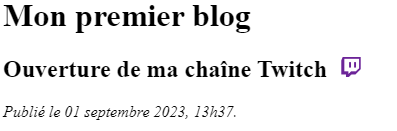
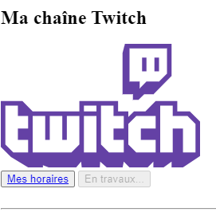

# **Exercice 3 - HTML**

En reprenant le travail de l'exercice 2, rajoutez les deux images contenues dans la section assets:

- La première devra être situé dans le titre du premier article. Elle doit faire 20px de haut
- La seconde image se situe dans la section "Ma chaîne Twitch" juste sous le titre. Elle doit faire 250px de large

---
## **Image 1**

---
## **Image 2**

---